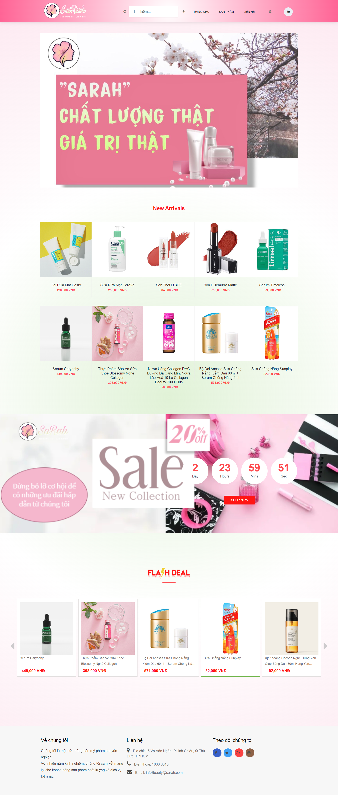

# Website_Java
Đồ án cơ sở: Web bán mỹ phẩm Sarah

#Link tham khảo 

Teamplate Error: https://codepen.io/uiswarup/pen/dyoyLOp

Teamplate Admin: https://github.com/fajarnurwahid/adminhub

Teamplate User: https://themewagon.com/themes/free-bootstrap-ecommerce-website-template-coloshop/

Tải ảnh lên Cloudinary: https://github.com/princesoni1989/Spring-Boot-Cloudinary.git

Thanh toán momo: https://github.com/momo-wallet/java.git

Gửi mail: https://github.com/AdityaKshettri/Sending-Emails-using-Spring-Boot-Mail.git

Thanh toán VNpay: https://sandbox.vnpayment.vn/apis/downloads/#

# Câu lệnh cần thiết để chạy với DOCKER-COMPOSE
- docker login
- docker-compose up --build
# Sử dụng JDK phiên bản 20 để tránh gặp lỗi nha

# Hình ảnh Demo

